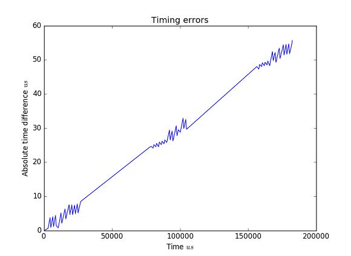

# DigitalScope - Library

This library is a collection of routines for recording events from digital input pins. It turns
your Arduino into a software logic analyzer. Carefully designed maximizing capture performance.

## Usage

One way of using a scope is by recording events during a fixed time period after a trigger
condition is met.

Include the library and configure a new scope.

```c++
// Include library
#include <DigitalScope.h>

// Initalize a new scope with max number of events 
// to collect (128) and target pin (2)
typedef scopes::DigitalScope<128, 2> Scope;
```

**DigitalScope** uses interrupt service routines to free your code from unnecessary polling. You can use callbacks on certain events to upate your main loop.

```c++

// Will be used to signal begin of event detection. 
bool started = false;

void setup()
{
    started = false;

    // Used for outputting captured values.
    Serial.begin(9600);
    while(!Serial) {}

    // Set a callback function to be invoked when data recording has begun. 
    scope.setBeginCallback(onBegin);

    // Start recording when we observe the first falling edge.
    scope.start(FALLING);
}
```

The callback function simply sets the `started` flag as shown below

```c++
void onBegin() 
{
    // Signal loop() that first event was recorded.
    started = true;
}
```

Finally in `loop()` we pause for 1 second once first event was observed and output all events captured during this period via the Serial interface.

```c++
void loop()
{
    if (started) {

        // Sleep for a second. 
        // Scope will continue to record data meanwhile.
        delay(1000);
        
        // Stop recording
        scope.stop();

        Serial.println("BEGIN DATA");

        const uint16_t nEvents = scope.numEvents();        
        for (uint16_t i = 0; i < nEvents; ++i)
        {
            // Print event time in microseconds since first event, 
            // event type RISING/FALLING and
            // resulting event state HIGH/LOW

            Serial.print(scope.timeOf(i)); Serial.print(" ");            
            Serial.print(scope.eventOf(i)); Serial.print(" ");
            Serial.print(scope.stateOf(i));

            Serial.println();
        }

        Serial.println("END DATA");

        // Restart the scope after a short pause.

        delay(5000);        
        started = false;
        scope.start(FALLING);
        Serial.println("LOG Ready for capture");
    }
}
```

More examples can be found in the [examples](examples/) directory.

## Accuracy

**DigitalScope** was developed for recording IR signals sent out by remotes operating at 38kHz. The following findings are based on differences of event arrival times reported between a hardware logic analyzer (Saleae Logic 4) and **DigitalScope** running on an Arduino Uno R3. Data was captured simulateously based on edge triggering over multiple runs.

We find that on average **DigitalScope** is off by `55us` after `180ms`. The image below shows how timing errors increase linearly with recording time. The three zigzags correspond to three data bursts sent from an IR remote. 



Since the timing error in between the bursts increases as well (i.e ISR is not invoked because no edge events occur), we could conclude that this effect can be attributed partly to the inaccuracy of the Arduino clock. 

Based on [literature](http://forum.arduino.cc/index.php?topic=13289.0) the Arduino Uno R3 uses a ceramic resonantor instead of a crystal. Typical errors of ceramic resonators range are around `0.5%` or `5000ppm`. Note this is backed by [this thread](http://forum.arduino.cc/index.php?topic=89784.0). `5000ppm` means the tolerated deviation from a nominal clock value is ~ +/- `900us` in every `180ms`. Far below the `55us` on average measured.

The [accuracy](http://support.saleae.com/hc/en-us/articles/208667166-Measurement-Error-Logic-timing-digital-pulse-width-) of the logic analyzer is `50ppm` or `0.005%`. It has been neglected in the above conclusion as well as other contributing factors such as when thresholds for analog signals are reached.